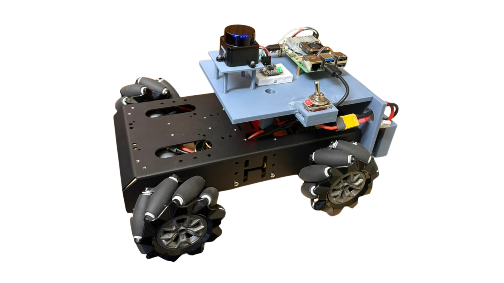

# 🌟 My Project Portfolio: Joseph M. Marra 🚀

Welcome to my project portfolio repository! My name is Joe, and I am an aspiring AI/Robotics engineer studying Computer Science at the **Georgia Institute of Technology** 🐝. This collection showcases various autonomous systems and robotics projects I've developed, demonstrating expertise in robotics, embedded systems, AI algorithms, and sensor integration. Each project aims to solve real-world problems through innovative autonomous solutions.

## **_FOR TECHNICAL DETAILS ABOUT EACH PROJECT VIEW THE README IN EACH PROJECT FOLDER_**

## 💻 Featured Projects

### 🤖 Paesano

**Overview:** Paesano is my primary robotics platform: a holonomic autonomous robot built for indoor navigation, path planning, localization, and closed-loop trajectory following. The system uses a Raspberry Pi 5 for high-level planning and estimation, a Raspberry Pi Pico for real-time motor control, and onboard sensing from a BNO085 IMU, LD19 LiDAR, and wheel encoders. The architecture is modular across firmware, control, localization, navigation, and mobile integration, with custom 3D-printed hardware and ROS 2-based software written primarily in C++.

  

---

### 🎯 Vision-Based Target Tracking & Pan-Tilt Control

**Overview:** This project combines computer vision with closed-loop servo control to build a real-time target tracking system. A camera detects and tracks colored objects, then sends position updates to an Arduino-controlled pan-tilt mechanism that keeps the target centered. The work focuses on vision processing, serial communication, and smooth actuator control rather than the specific hardware mounted on the platform.

  

**Team:** Made in collaboration with Francis Leahy and Matthew Russo

---

### 🏀 SWISHHH!

**Overview:** SWISHHH! is a four-person AI ATL group project built around live NBA game data, webcam gesture input, and real-time shot prediction gameplay. The app combines live scoreboard and play-by-play feeds with gesture-based interaction to create a polished, fast-moving prediction experience. I include it here as a collaboration project rather than a solo-owned codebase.

**Team:** Made in collaboration with Kevin Gao, Nash Pillai, and Neha Nataraj

**Links:** [Original Repository](https://github.com/Pudging/AIATL) · [Devpost](https://devpost.com/software/swishhh) · [Archived Demo](https://aiatl.vercel.app)

  

---

### 🪐 Cosmic Collector

**Overview:** Cosmic Collector is a four-person Robotech 2026 hackathon project built around autonomous cave navigation, wall avoidance, and physical ore marking in a Mars-inspired environment. The robot combined a mecanum chassis, camera, IMU, LiDAR, ROS-based navigation, and custom ESP32 firmware under tight hackathon time pressure.

**Team:** Made in collaboration with Hiroyuki Sakuma, Nash Pillai, and Quinn Kortbus

**Links:** [Original Repository](https://github.com/Hiptostee/robotech) · [Devpost](https://devpost.com/software/cosmic-collector)

  

---

## 💡 Skills & Technologies

This portfolio demonstrates proficiency in technologies central to autonomous systems and robotics, including:

- **Robotics & Embedded Systems:** C++, Python, ROS2, Probabilistic State Estimation (Extended Kalman Filter, Monte Carlo Localization), Control Algorithms (PID, LQR), Path Planning Algorithms (A\*), Real-time Motor Control, Sensor Fusion, I2C Communication, Firmware Development, Mechanical Design (CAD, 3D Printing), Arduino, Raspberry Pi, ESP32

- **AI/ML & NLP:** OpenAI API, OpenCV, Prompt Engineering, Large Language Models (LLMs)

- **Computer Vision:** OpenCV (Object Detection, Tracking, Filtering, Color Spaces)

## 📞 Contact

For any inquiries or collaborations, feel free to reach out to me!:

- **Phone:** 1-845-219-2687

- **Email:** josephmmarra2007@gmail.com

- **LinkedIn:** [Joseph Marra](https://linkedin.com/in/joseph-marra-245185273/)

---
